# SlyTab — the manual

SlyTab keeps track of money shared between people who know each other. A
trip, a household, a dinner someone put on their card. You record what was
spent, it works out who owes whom, and you settle up.

Every screenshot here is generated from the running app against fixed demo
data, so what you see is what the app currently does — not what it looked
like when someone last remembered to update a manual.

---

## Signing in {#signing-in}

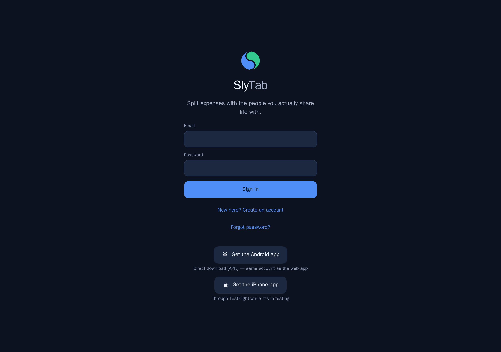

You can create an account with an email and password, or sign in with Apple
or Google.

There is nothing to install: SlyTab runs in any browser, and there are iPhone
and Android apps if you would rather have one on your phone. The same account
works everywhere.

If someone has invited you to a group, sign in first and the invitation is
applied automatically — you land in the group.

---

## Home — where you stand {#home}

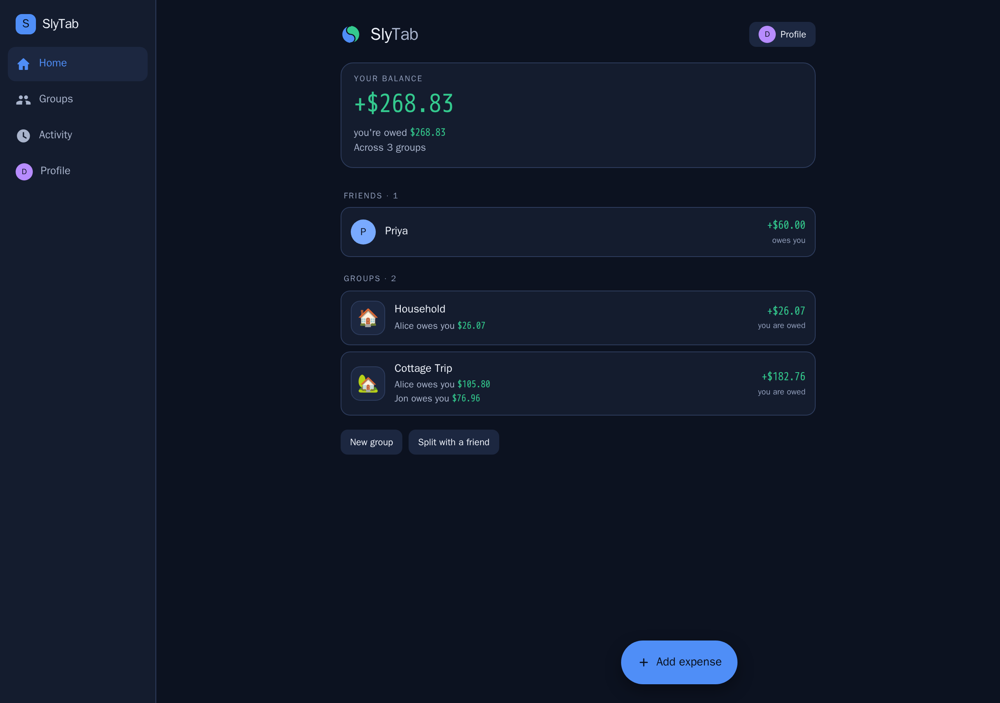

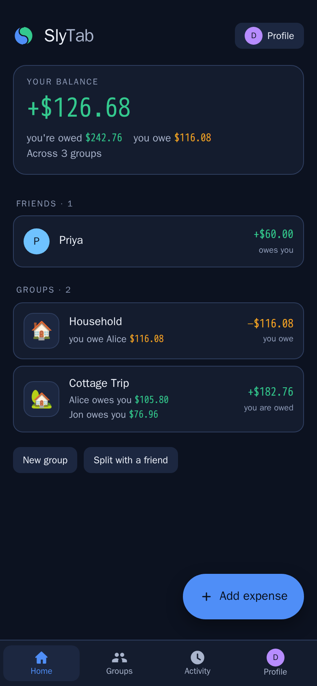

Home answers one question: **across everything, who owes whom?**

Each row is a person, not a group. If you and Alice share a household *and* a
ski trip, you see one number for Alice — because when you settle up, you
settle one number, not two.

Green means you are owed. Amber means you owe. "Settled" means exactly that.

The **Add expense** button is always in the bottom corner, on every screen
where adding one makes sense.

On a narrow window the navigation moves to the bottom, the way it is on a
phone.

---

## Groups {#groups}

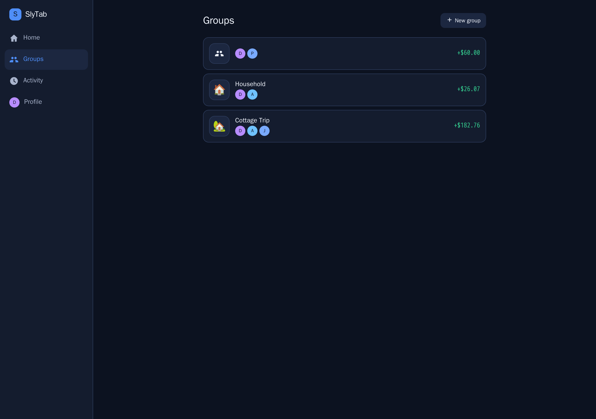

A group is a set of people and the expenses they share. A ski trip, a flat, a
recurring dinner.

Each card shows the group's emoji, its members, and where you stand in that
group specifically.

Groups you have finished with can be archived: they collapse out of the way
but keep their history, so old balances stay honest.

**One-to-one splitting needs no group at all** — you can split directly with
one person.

---

## A group's expenses {#group-expenses}

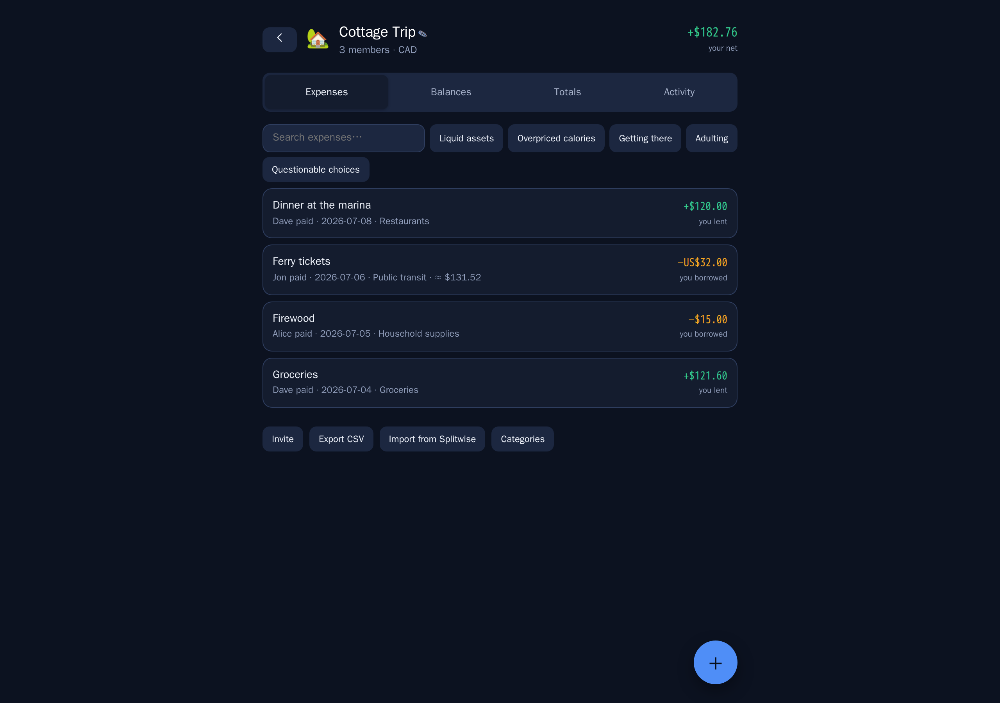

Every expense in the group, newest first, with what it was, who paid, and
your share.

Search narrows the list. So do the category chips.

Tap any expense to edit it. Delete asks first, and can be undone straight
afterwards.

---

## Balances, and how to settle {#group-balances}

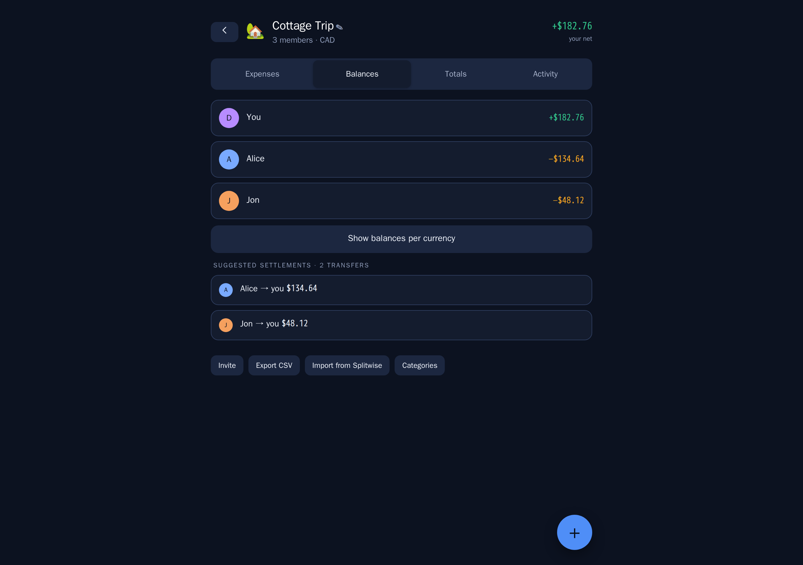

Balances shows what each person owes within this group, and — more usefully —
**the shortest set of payments that clears everyone**.

If Alice owes Ben, and Ben owes you, SlyTab does not make Alice pay Ben so
Ben can pay you. It tells Alice to pay you directly. Fewer payments, same
result.

---

## Totals {#group-totals}

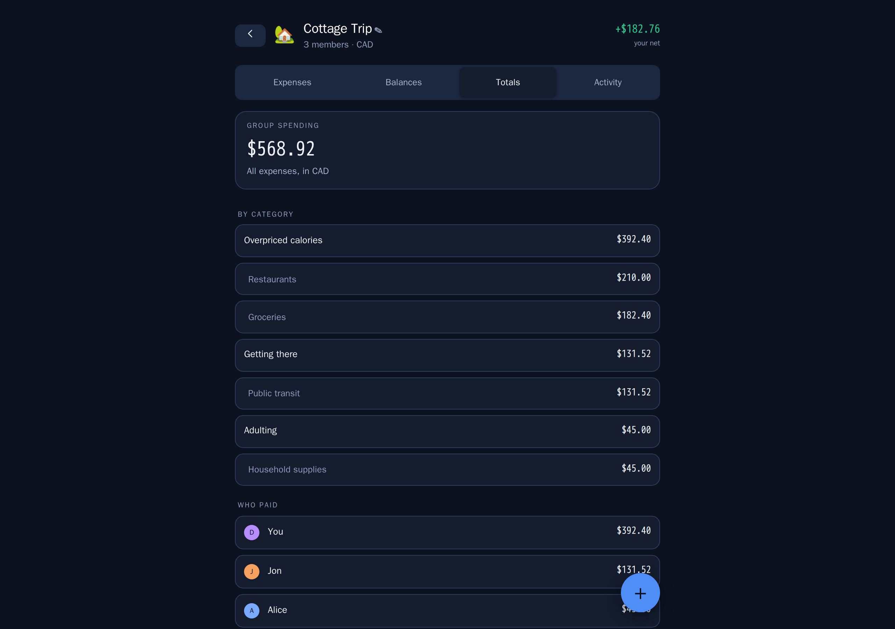

Where the money actually went: by person and by category.

Useful mid-trip, when someone asks whether the group is overspending on
restaurants, and afterwards, when you want to know what a holiday really
cost.

---

## Adding an expense {#add-expense}

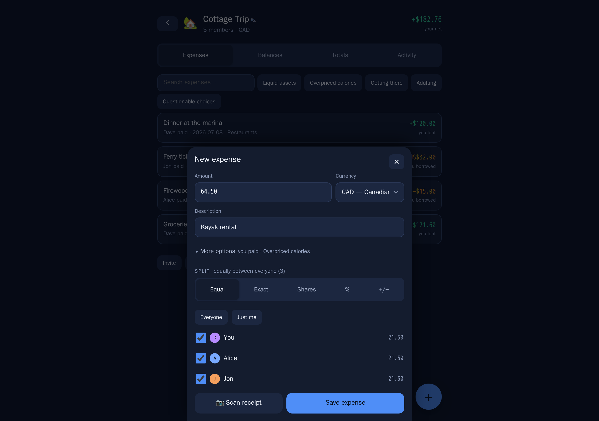

The fast path is three fields: what, how much, who paid. Everything else has
a sensible default — today's date, an equal split, the group's currency.

When equal is not right:

| Method | Use it when |
|---|---|
| **Equal** | The usual case. Optionally exclude anyone who was not there. |
| **Exact** | You know each person's amount — a restaurant bill you have itemised. |
| **Shares** | Two of you had the double room and one had the single: 2 : 1. |
| **Percent** | A household splitting 60 / 40. |
| **+ / −** | Split equally, then adjust one person up or down for the extra drink. |

**More than one person can pay.** If you put £60 on your card and Alice put
£40 on hers, record both — the split and the paying are separate questions.

**Scan the receipt** instead of typing. Photograph it and the total, the date
and the line items come back filled in. From there you can split **by item**,
which is what you want when three of you shared the starter and one did not.

The receipt is read by a model running on our own server. No third-party
service is configured, so receipts do not leave it. Location data is stripped
from JPEG photos when they arrive.

---

## Different currencies {#currencies}

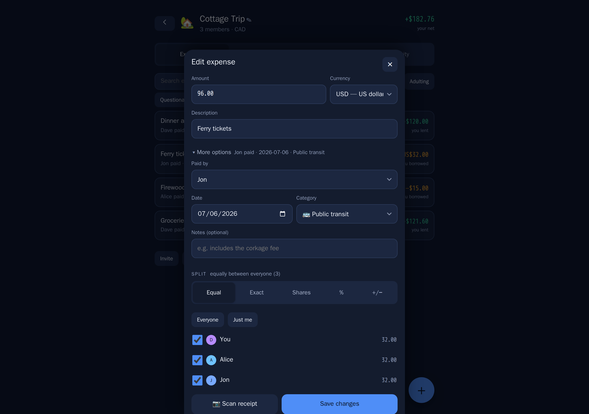

Enter an expense in the currency you actually paid in. SlyTab keeps that
currency on the expense and converts it to the group's home currency using
the reference rate **for the date of the expense**, then stores that rate on
the expense.

That last part matters. Nothing re-values your history in the background, so
a balance you agreed on last month does not quietly become a different number
this month.

The original amount is always shown; the converted one is secondary.

**If your card gave you a different rate**, override it — enter the rate you
were actually charged. One caveat worth knowing: if you later edit that
expense, re-enter the override, because saving re-reads the rate for the
date.

Currencies without decimal places — Chilean pesos, yen, won — are handled
properly throughout. A total of 88.930 CLP means eighty-eight thousand nine
hundred and thirty, and SlyTab reads it that way.

---

## Settling up {#settling-up}

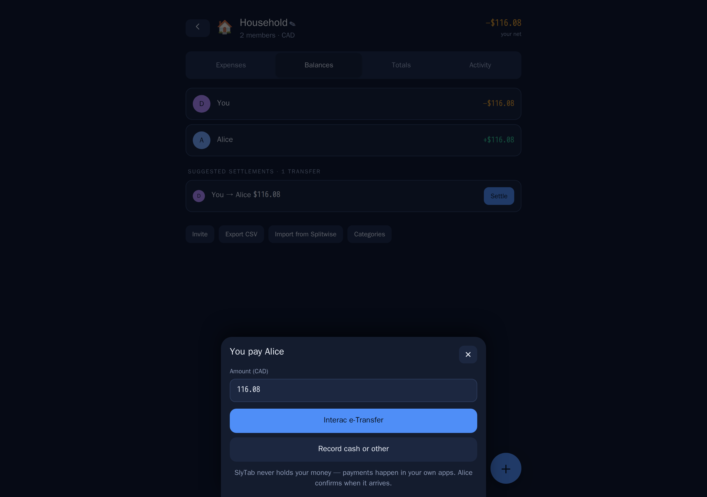

When someone pays you back, record it. They are asked to confirm, and once
they do the balance between you clears.

SlyTab does not move money. It records that money moved. Your payment handles
— Interac e-Transfer, PayPal.Me, Venmo — live on your profile so the other
person can find them without asking.

---

## Activity {#activity}

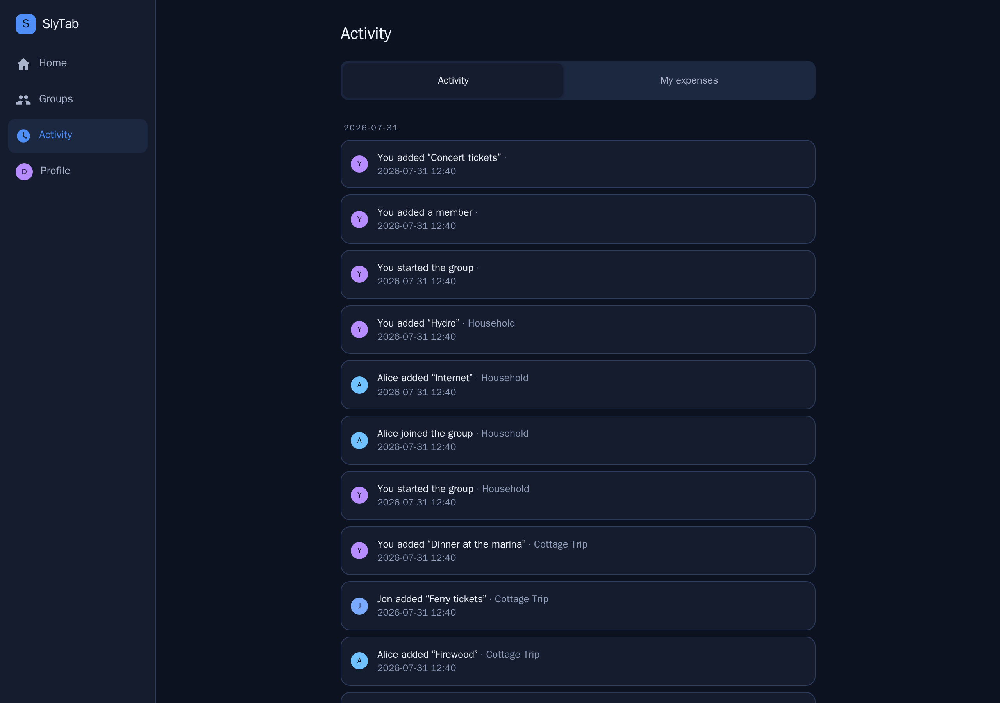

Everything that has happened across all your groups, newest first, grouped by
day. Who added what, who confirmed a payment, who joined.

Useful when you open the app after a week away and want to know what changed.

---

## Everything you have spent {#my-expenses}

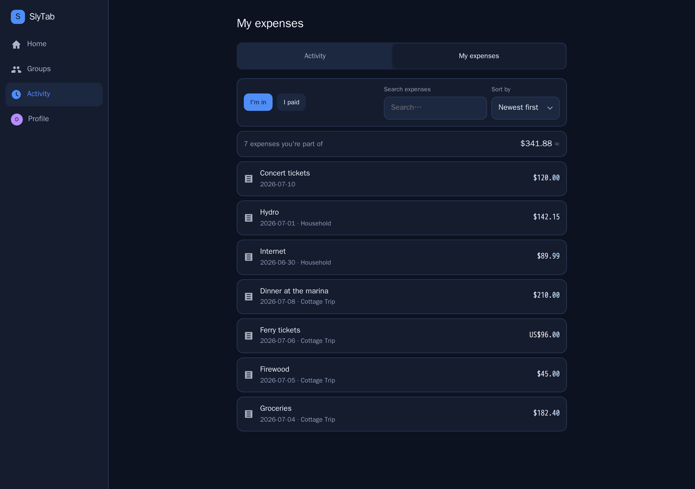

The **My expenses** tab answers a question no per-group screen can: *what have
I been spending, across everything?*

Two views:

- **I'm in** — every expense you hold a share of, whoever entered it. This is
  your money.
- **I paid** — the ones where your money actually went out.

Sort by newest, oldest, largest or smallest, search, and see a running total
of **your share** — not the total of the bills, which would be someone else's
number.

---

## Profile and settings {#profile}

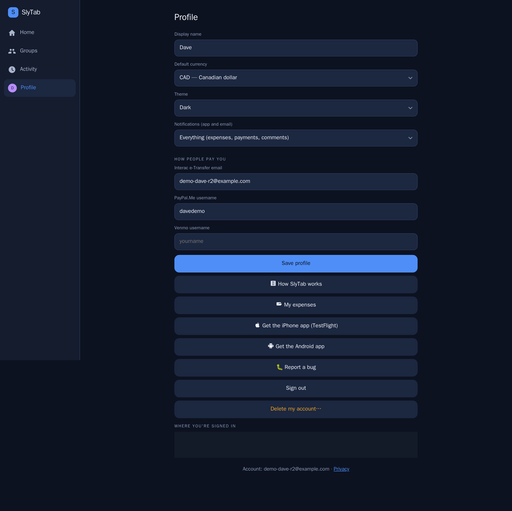

- **Theme** — match your device, or force dark or light.
- **Default currency** — what your balances are shown in.
- **Notifications** — everything, important only, or nothing.
- **How people pay you** — Interac, PayPal.Me, Venmo handles.
- **Devices** — every signed-in session, with the ability to revoke any of
  them.
- **How SlyTab works** — this manual, from inside the app.
- **Report a bug** — goes straight to us with your app version attached, and
  you get an email when it is fixed.
- **Delete my account** — really deletes it. Your share of shared history is
  anonymised so nobody else's balances change.

---

## Getting other people in

Three ways, in order of how little effort they take:

1. **People you already know** — anyone from your other groups, one tap, no
   email needed.
2. **A share link** — send it however you like. It works for seven days and
   can be revoked.
3. **By email** — they get an invitation, and their share is tracked from the
   moment you add them, whether or not they ever sign up.

**Moving from Splitwise?** Import a group directly, mapping their members
onto people you already know. Anything already in SlyTab is skipped rather
than duplicated.

---

## Leaving a group

Open the group, tap its name, then **Leave this group**. You are asked to
settle up first if you still owe or are owed anything.

Your past expenses stay, so nobody else's balance moves.
